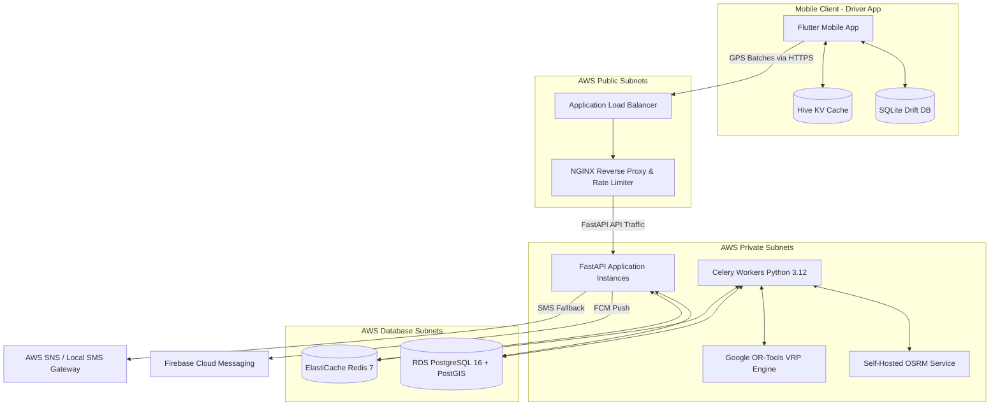
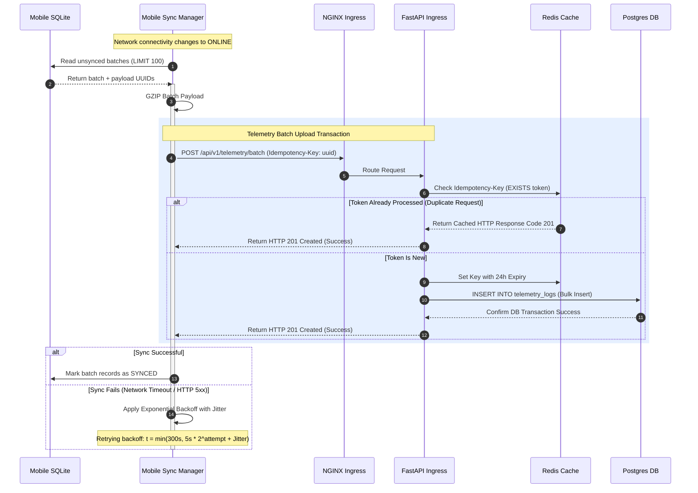
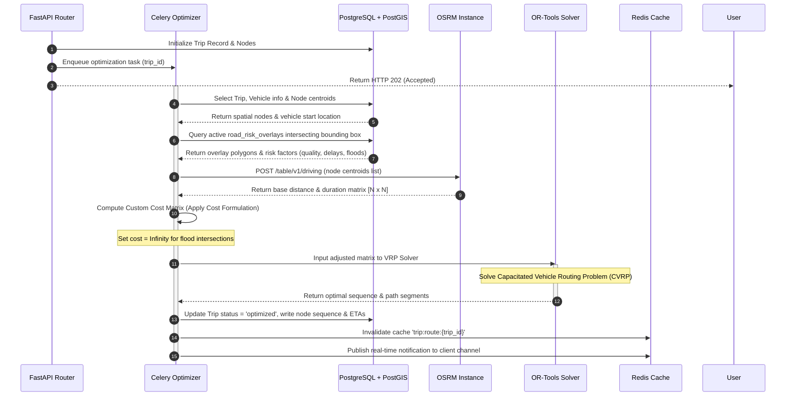

# RouteIQ: Technical Architecture Blueprint
**Definitive Engineering Specification for Enterprise Fleet Management and AI Route Optimization**

---

## 1. Executive Architecture Summary & Core Trade-Offs

RouteIQ is designed as a resilient, offline-first fleet management and AI-driven routing platform optimized for the infrastructure realities of the Nigerian logistics ecosystem. The system addresses critical operational issues: high fuel costs (mitigated by a 35–40% diesel consumption reduction), unstable power/battery states, and intermittent cellular connectivity (requiring continuous 72-hour offline operation along interstate corridors).

```
                      +-------------------+
                      |   Flutter Client  |
                      |  (Offline-First)  |
                      +---------+---------+
                                |
                                | HTTPS (Protobuf / JSON)
                                v
                      +---------+---------+
                      |   NGINX Ingress   |
                      +---------+---------+
                                |
                                v
                      +---------+---------+
                      |  FastAPI Gateway  |
                      +----+---------+----+
                           |         |
      Read/Write (JWT/SQL) |         | Queue Task
                           v         v
                 +---------+---+  +--+----------+
                 | PostgreSQL  |  | Redis Cache |
                 | (w/ PostGIS)|  |  & Broker   |
                 +-------------+  +--+----------+
                                     |
                                     | Pull Task
                                     v
                                  +--+----------+
                                  |   Celery    |
                                  | Routing Host|
                                  +--+-----+----+
                                     |     |
                 Query Base Matrix   |     | Execute Solver
                 +-------------------+     +------------------+
                 v                                            v
         +-------+-------+                            +-------+-------+
         | Self-Hosted   |                            | Google        |
         | OSRM (OSM)    |                            | OR-Tools VRP  |
         +---------------+                            +---------------+
```

### Core Architecture Trade-Offs

#### 1. Payload Serialization: Protocol Buffers vs. GZIP-compressed JSON
* **Selection**: **Protocol Buffers (Protobuf)** for mobile telemetry ingestion; **GZIP-compressed JSON** for standard administrative REST API endpoints.
* **Rationale**: Telemetry updates occur at $1\text{ Hz}$ frequency. Over a 72-hour offline period, a single driver accumulates $259,200$ GPS coordinate records. A raw JSON payload representing this queue would exceed $36\text{ MB}$. Using Protobuf, the binary representation drops to approximately $5.2\text{ MB}$ (an $85\%$ reduction). This minimizes driver cellular data charges and reduces API ingestion times on spotty edge connections.

#### 2. Local Storage: SQLite (via Drift) vs. Hive (NoSQL)
* **Selection**: **SQLite (Drift)** for core telemetry queues and trip transactional states; **Hive** for lightweight key-value preferences and cached session states.
* **Rationale**: Telemetry tracking and trip updates require strict ACID guarantees. If a driver's mobile device battery dies, SQLite's write-ahead logging (WAL) prevents data corruption. Drift provides compile-time safe queries, relation mappings, and complex filtering (e.g., computing distance traveled offline), which are error-prone in a flat NoSQL KV engine like Hive.

#### 3. Concurrency & Heavy Compute Separation: FastAPI (Async IO) vs. Synchronous Workers
* **Selection**: **Asynchronous FastAPI web workers** communicating with **Celery Task Queues** backed by **Redis** for routing computation.
* **Rationale**: Google OR-Tools VRP solver and OSRM matrix queries are highly CPU-bound. If executed inside the web request lifecycle, the event loop would block, degrading P99 API response latencies. Offloading VRP optimization to Celery workers running on dedicated compute-optimized nodes keeps the API gateway highly responsive (<300ms latency).

#### 4. Sync Reconciliation: State-Based CRDTs vs. Vector Clocks with Last-Write-Wins (LWW)
* **Selection**: **Vector Clocks** for complex trip state transitions combined with **Idempotent UUIDv4 tokens** for telemetry deduplication.
* **Rationale**: Fleet managers can modify trip routes online while drivers progress through deliveries offline. Standard LWW would overwrite dispatch updates. By assigning Vector Clocks `[Client_Epoch, Server_Epoch]` to the Trip entity, we detect concurrent modifications. Conflicts are resolved via deterministic merge rules (e.g., preserving driver node visitation status while updating remaining destinations).

---

## 2. System Topology & Component Diagram

The following architecture diagram represents the topology and end-to-end data flow of RouteIQ, routing through the AWS Cape Town (`af-south-1`) region.



---

## 3. Offline Synchronization State Machine

The client telemetry database acts as a transactional queue. Telemetry events are stored locally during offline state and synchronized once connectivity is restored.

### Telemetry Packet Struct (Protobuf Schema)
```protobuf
syntax = "proto3";

package routeiq.telemetry;

message TelemetryRecord {
  string record_id = 1;      // UUIDv4 generated on mobile client
  string trip_id = 2;        // Nullable if vehicle is off-trip
  double latitude = 3;
  double longitude = 4;
  double speed_kph = 5;
  double heading_degrees = 6;
  int64 timestamp_utc = 7;   // Epoch timestamp in milliseconds
  double battery_level = 8;
  bool is_charging = 9;
  string network_type = 10;  // "WIFI", "4G", "3G", "2G", "NONE"
}

message TelemetryBatch {
  string device_uuid = 1;
  string telemetry_token = 2; // Transactional token for idempotency
  repeated TelemetryRecord records = 3;
}
```

### Sync Reconciliation Sequence



---

## 4. Database Domain Design

### Entity-Relationship Model (Textual Mapping)

1. **`drivers`**
   * One-to-One with `vehicles`.
   * One-to-Many with `trips`.
2. **`vehicles`**
   * One-to-Many with `telemetry_logs`.
3. **`trips`**
   * One-to-Many with `trip_nodes`.
   * One-to-Many with `telemetry_logs` (linked for exact trip paths).
4. **`trip_nodes`** (Delivery Drop-offs)
   * Represents sequential deliveries within a trip.
5. **`road_risk_overlays`**
   * Polygons indicating risk zones (floods, checkpoint hotspots, degraded routes).

```
  +--------------+          +---------------+          +--------------------+
  |   drivers    | 1      1 |   vehicles    | 1      N |   telemetry_logs   |
  |--------------|----------|---------------|----------|--------------------|
  | id (PK)      |          | id (PK)       |          | id (PK)            |
  | name         |          | plate_number  |          | vehicle_id (FK)    |
  | phone        |          | status        |          | trip_id (FK)       |
  +-------+------+          +-------+-------+          | geom_location (GIS)|
          | 1                       |                  | timestamp_utc      |
          |                         |                  +--------------------+
          | N                       | 1
  +-------v------+                  |
  |    trips     |<-----------------+
  |--------------|
  | id (PK)      |
  | driver_id(FK)|
  | vehicle_id(FK)
  | status       |
  +-------+------+
          | 1
          | N
  +-------v------+
  |  trip_nodes  |
  |--------------|
  | id (PK)      |
  | trip_id (FK) |
  | seq_index    |
  | geofence_geom| (GIST index)
  +--------------+
```

### Production-Ready PostgreSQL / PostGIS DDL Schema Script

```sql
-- Enable PostGIS extension for spatial analysis
CREATE EXTENSION IF NOT EXISTS postgis;

-- Driver State enumeration
CREATE TYPE driver_status_enum AS ENUM ('active', 'inactive', 'suspended');

-- Vehicle State enumeration
CREATE TYPE vehicle_status_enum AS ENUM ('operational', 'maintenance', 'decommissioned');

-- Trip State enumeration
CREATE TYPE trip_status_enum AS ENUM ('pending', 'optimized', 'in_transit', 'completed', 'canceled');

-- Trip Node State enumeration
CREATE TYPE node_status_enum AS ENUM ('pending', 'arrived', 'delivered', 'skipped');

-- 1. Drivers Table
CREATE TABLE drivers (
    id UUID PRIMARY KEY DEFAULT gen_random_uuid(),
    first_name VARCHAR(100) NOT NULL,
    last_name VARCHAR(100) NOT NULL,
    phone_number VARCHAR(20) UNIQUE NOT NULL,
    license_number VARCHAR(50) UNIQUE NOT NULL,
    status driver_status_enum NOT NULL DEFAULT 'active',
    created_at TIMESTAMP WITH TIME ZONE DEFAULT CURRENT_TIMESTAMP,
    updated_at TIMESTAMP WITH TIME ZONE DEFAULT CURRENT_TIMESTAMP
);

-- 2. Vehicles Table
CREATE TABLE vehicles (
    id UUID PRIMARY KEY DEFAULT gen_random_uuid(),
    plate_number VARCHAR(20) UNIQUE NOT NULL,
    model VARCHAR(50) NOT NULL,
    fuel_capacity_liters NUMERIC(5,2) NOT NULL,
    current_driver_id UUID REFERENCES drivers(id) ON DELETE SET NULL,
    status vehicle_status_enum NOT NULL DEFAULT 'operational',
    created_at TIMESTAMP WITH TIME ZONE DEFAULT CURRENT_TIMESTAMP,
    updated_at TIMESTAMP WITH TIME ZONE DEFAULT CURRENT_TIMESTAMP
);

-- 3. Trips Table
CREATE TABLE trips (
    id UUID PRIMARY KEY DEFAULT gen_random_uuid(),
    driver_id UUID REFERENCES drivers(id) NOT NULL,
    vehicle_id UUID REFERENCES vehicles(id) NOT NULL,
    status trip_status_enum NOT NULL DEFAULT 'pending',
    start_time TIMESTAMP WITH TIME ZONE,
    end_time TIMESTAMP WITH TIME ZONE,
    estimated_distance_meters NUMERIC(10,2),
    estimated_duration_seconds INTEGER,
    vector_clock_client INTEGER NOT NULL DEFAULT 0,
    vector_clock_server INTEGER NOT NULL DEFAULT 0,
    created_at TIMESTAMP WITH TIME ZONE DEFAULT CURRENT_TIMESTAMP,
    updated_at TIMESTAMP WITH TIME ZONE DEFAULT CURRENT_TIMESTAMP
);

-- 4. Trip Nodes (Geofenced Delivery Locations)
CREATE TABLE trip_nodes (
    id UUID PRIMARY KEY DEFAULT gen_random_uuid(),
    trip_id UUID REFERENCES trips(id) ON DELETE CASCADE NOT NULL,
    sequence_index INTEGER NOT NULL,
    node_status node_status_enum NOT NULL DEFAULT 'pending',
    address TEXT NOT NULL,
    geofence_geom GEOMETRY(Polygon, 4326) NOT NULL, -- 100m radius polygon around point
    centroid_geom GEOMETRY(Point, 4326) NOT NULL,    -- Raw destination coordinate
    eta TIMESTAMP WITH TIME ZONE,
    actual_arrival TIMESTAMP WITH TIME ZONE,
    actual_departure TIMESTAMP WITH TIME ZONE,
    created_at TIMESTAMP WITH TIME ZONE DEFAULT CURRENT_TIMESTAMP,
    CONSTRAINT unique_trip_sequence UNIQUE (trip_id, sequence_index)
);

-- 5. Telemetry Logs Table (High-Write Volumetric Database)
CREATE TABLE telemetry_logs (
    id UUID PRIMARY KEY DEFAULT gen_random_uuid(),
    vehicle_id UUID REFERENCES vehicles(id) ON DELETE CASCADE NOT NULL,
    trip_id UUID REFERENCES trips(id) ON DELETE SET NULL,
    geom_location GEOMETRY(Point, 4326) NOT NULL, -- Lat/Long projection
    speed_kph NUMERIC(5,2) NOT NULL,
    heading_degrees NUMERIC(5,2) NOT NULL,
    battery_level NUMERIC(3,2) NOT NULL, -- Value between 0.00 and 1.00
    timestamp_utc TIMESTAMP WITH TIME ZONE NOT NULL,
    created_at TIMESTAMP WITH TIME ZONE DEFAULT CURRENT_TIMESTAMP
);

-- 6. Road Risk Overlays (Floods, Police Checkpoints, Road Degradation)
CREATE TABLE road_risk_overlays (
    id UUID PRIMARY KEY DEFAULT gen_random_uuid(),
    risk_type VARCHAR(50) NOT NULL, -- 'flood', 'police_delay', 'degraded_road'
    severity_multiplier NUMERIC(3,2) NOT NULL, -- Multiplier on baseline travel time (e.g. 2.5)
    fixed_delay_seconds INTEGER NOT NULL DEFAULT 0,
    risk_geom GEOMETRY(Polygon, 4326) NOT NULL, -- Spatial region of hazard
    is_active BOOLEAN NOT NULL DEFAULT TRUE,
    expires_at TIMESTAMP WITH TIME ZONE,
    created_at TIMESTAMP WITH TIME ZONE DEFAULT CURRENT_TIMESTAMP
);

-- Create Spatial Indexes (GIST) for Fast Geospatial Operations
CREATE INDEX idx_telemetry_logs_geom ON telemetry_logs USING GIST (geom_location);
CREATE INDEX idx_trip_nodes_geofence ON trip_nodes USING GIST (geofence_geom);
CREATE INDEX idx_trip_nodes_centroid ON trip_nodes USING GIST (centroid_geom);
CREATE INDEX idx_road_risk_geom ON road_risk_overlays USING GIST (risk_geom);

-- Create B-Tree Indexes for Relational Join Performance
CREATE INDEX idx_telemetry_vehicle_timestamp ON telemetry_logs (vehicle_id, timestamp_utc DESC);
CREATE INDEX idx_trips_driver ON trips (driver_id);
CREATE INDEX idx_trip_nodes_trip ON trip_nodes (trip_id);
```

---

## 5. Asynchronous AI Routing Pipeline Engine Architecture

Route optimization is executed asynchronously, factoring in historical checkpoint wait times, live flooding, and road quality indexes.

### Cost Function Formulation
For any road segment $e$ in the routing graph, the adjusted cost (weight) in terms of travel time $C(e)$ is calculated as:

$$C(e) = T_{\text{base}}(e) \times W_{\text{quality}}(e) \times \prod_{f \in F_{\text{active}}} M_{\text{flood}}(e, f) + \sum_{p \in P_{\text{active}}} D_{\text{checkpoint}}(e, p)$$

Where:
* $T_{\text{base}}(e)$: Base travel time calculated by OSRM using standard OpenStreetMap road segments.
* $W_{\text{quality}}(e)$: Scalar weight based on road quality classification (e.g., $1.0$ for expressways, $1.8$ for degraded local roads).
* $M_{\text{flood}}(e, f)$: Multiplier representing severity of flooding. If the road segment intersects a highly severe flood polygon $f$, the multiplier approaches infinity ($\infty$), forcing the VRP engine to bypass the segment.
* $D_{\text{checkpoint}}(e, p)$: Fixed delay penalty in seconds representing average delay at police checkpoints or toll gates.

### Routing Execution Lifecycle



### Dynamic Rerouting Triggers
The system monitors telemetry streams and triggers rerouting under specific conditions:
1. **Deviation Threshold**: The vehicle's distance to the planned path segment exceeds $250\text{ meters}$ (detected via PostGIS `ST_Distance`).
2. **Geofence Bypass**: A driver skips a delivery node, moving more than $500\text{ meters}$ past it without registering a stop.
3. **Severe Delay Detection**: The actual travel time for a segment exceeds the planned ETA by more than $30\text{ minutes}$ (indicates checkpoint backups or localized flooding).

---

## 6. API Design & Security Architecture

### Authentication Mechanism
The system utilizes JWT-based authentication for all client-to-backend operations.

* **Token Issuance**: FastAPI validates credentials and signs asymmetric HS256 JWTs containing `sub` (User ID), `role` (Driver/Dispatcher), and `jti` (Unique Token Identifier).
* **Token Blacklisting**: On logout or token revocation, the token's `jti` is written to Redis with an expiration time matched to the remaining TTL of the token. FastAPI middleware verifies all incoming JWTs against the Redis blacklist before proceeding.

### Core Endpoints

#### 1. Trip Creation & Optimization Request
* **Endpoint**: `POST /api/v1/trips`
* **Security**: Bearer JWT (Roles: `dispatcher`, `admin`)
* **Request Payload**:
```json
{
  "driver_id": "18f50438-6629-4cc4-85df-e4b2dcdb6cf1",
  "vehicle_id": "3be54972-23c8-472e-836b-2877a5de12cf",
  "delivery_nodes": [
    {
      "sequence_index": 0,
      "address": "45 Warehouse Road, Apapa, Lagos",
      "latitude": 6.4429,
      "longitude": 3.3614
    },
    {
      "sequence_index": 1,
      "address": "Ikorodu Road Depot, Lagos",
      "latitude": 6.5982,
      "longitude": 3.3742
    }
  ]
}
```
* **Response Payload (HTTP 202 Accepted)**:
```json
{
  "trip_id": "a9ef382b-df51-419b-a01c-6d2cde5432ab",
  "status": "pending",
  "task_id": "celery-task-88912-abc",
  "message": "Route optimization initiated."
}
```

#### 2. Batched Telemetry Ingestion
* **Endpoint**: `POST /api/v1/telemetry/batch`
* **Security**: Bearer JWT (Roles: `driver`)
* **Request Payload** (If sending fallback JSON instead of binary Protobuf):
```json
{
  "device_uuid": "f292d348-7323-4554-ba8f-287df1c998a1",
  "telemetry_token": "token-9981-aabc",
  "records": [
    {
      "record_id": "67cb1551-455d-4f11-8be5-67c29e1dbcf1",
      "trip_id": "a9ef382b-df51-419b-a01c-6d2cde5432ab",
      "latitude": 6.4430,
      "longitude": 3.3615,
      "speed_kph": 12.50,
      "heading_degrees": 182.40,
      "timestamp_utc": 1783459200000,
      "battery_level": 0.88,
      "is_charging": false,
      "network_type": "4G"
    }
  ]
}
```
* **Response Payload (HTTP 201 Created)**:
```json
{
  "status": "success",
  "processed_records": 1,
  "telemetry_token": "token-9981-aabc"
}
```

---

## 7. Mobile Client Clean Architecture Layout

The Flutter client enforces Clean Architecture principles, ensuring that UI components are isolated from data access models and network serialization tasks.

### Directory Structure

```
lib/
│
├── core/
│   ├── network/
│   │   ├── http_client.dart       # Network interface wrapper (Dio)
│   │   └── sync_scheduler.dart    # Network state listeners and triggers
│   ├── database/
│   │   ├── app_database.dart      # Drift SQLite initialization schema
│   │   └── key_value_store.dart   # Hive key-value cache
│   └── errors/
│       └── exceptions.dart        # Custom Domain mapping exceptions
│
├── features/
│   ├── telemetry/
│   │   ├── data/
│   │   │   ├── datasources/
│   │   │   │   ├── telemetry_local_datasource.dart  # Drift SQLite operations
│   │   │   │   └── telemetry_remote_datasource.dart # Remote Protobuf uploads
│   │   │   ├── models/
│   │   │   │   └── telemetry_model.dart             # Database mappings & serialization
│   │   │   └── repositories/
│   │   │       └── telemetry_repository_impl.dart   # Logic orchestrating sync/writes
│   │   └── domain/
│   │       ├── entities/
│   │       │   └── telemetry_entity.dart            # Pure Dart domain representation
│   │       ├── repositories/
│   │       │   └── telemetry_repository.dart        # Interface contract definition
│   │       └── usecases/
│   │           └── record_location_usecase.dart     # Business logic wrapper
│   │
│   └── trip/
│       ├── data/
│       │   ├── datasources/
│       │   │   ├── trip_local_datasource.dart
│       │   │   └── trip_remote_datasource.dart
│       │   ├── models/
│       │   │   ├── trip_model.dart
│       │   │   └── trip_node_model.dart
│       │   └── repositories/
│       │       └── trip_repository_impl.dart
│       ├── domain/
│       │   ├── entities/
│       │   │   ├── trip_entity.dart
│       │   │   └── trip_node_entity.dart
│       │   ├── repositories/
│       │   │   └── trip_repository.dart
│       │   └── usecases/
│       │       ├── get_active_trip_usecase.dart
│       │       └── update_node_status_usecase.dart
│       └── presentation/
│           ├── blocs/
│           │   ├── trip_bloc.dart
│           │   ├── trip_event.dart
│           │   └── trip_state.dart
│           ├── pages/
│           │   ├── trip_dashboard_page.dart
│           │   └── map_view_page.dart
│           └── widgets/
│               ├── geofence_indicator_widget.dart
│               └── delivery_node_card_widget.dart
│
└── main.dart # App entry point
```

---

## 8. AWS Infrastructure Blueprint & CI/CD Spec

Deployment is designed for the high-availability constraints of AWS Cape Town (`af-south-1`).

```
                              Internet
                                 |
                        +--------v--------+
                        |  Route 53 / DNS |
                        +--------+--------+
                                 |
                  +--------------v--------------+
                  |  Application Load Balancer  | (Public Subnet)
                  +--------------+--------------+
                                 |
          +----------------------+----------------------+
          | (AZ-A Private)                              | (AZ-B Private)
  +-------v-------+                             +-------v-------+
  |  ECS Service  |                             |  ECS Service  |
  |  (FastAPI)    |                             |  (FastAPI)    |
  +-------+-------+                             +-------+-------+
          |                                             |
          +----------------------+----------------------+
                                 |
                         +-------v-------+
                         |  ECS Service  |
                         |  (Celery)     |
                         +-------+-------+
                                 |
          +----------------------+----------------------+
          | (AZ-A Data)                                 | (AZ-B Data)
  +-------v-------+                             +-------v-------+
  |  PostgreSQL   |                             |  PostgreSQL   |
  |  RDS Master   |                             |  RDS Replica  |
  +-------+-------+                             +---------------+
          |
  +-------v-------+
  | ElastiCache   |
  | Redis Master  |
  +---------------+
```

### Infrastructure Specs

* **Network Topology**:
  * Private VPC (`10.0.0.0/16`) spanning 2 Availability Zones (`af-south-1a`, `af-south-1b`).
  * **Public Subnets**: Application Load Balancers, NAT Gateways.
  * **Private Subnets**: FastAPI web service, Celery worker nodes, self-hosted OSRM router.
  * **Data Subnets**: RDS Multi-AZ PostgreSQL instances, ElastiCache Redis cluster.
* **Compute Layer Configuration**:
  * **FastAPI Application**: ECS Fargate, scaling dynamically based on average CPU target ($70\%$).
  * **OSRM Routing Host**: Self-hosted on EC2 instances (`c6i.xlarge` - 4 vCPUs, 8 GB RAM) optimized for fast in-memory map graph analysis. Memory-mapped storage paths are loaded directly with Nigerian OpenStreetMap (.osm) extraction binaries.
* **Reverse Proxy & Ingress (NGINX)**:
  * Manages TLS termination (AWS Certificate Manager integration).
  * Rate-limits client telemetry endpoints to prevent DDoS (configured to 5 requests/sec per client IP with a burst allowance of 10).
* **Monitoring Stack**:
  * **Prometheus**: Scrapes application metrics via `/metrics` FastAPI endpoints and Celery Prometheus Exporters.
  * **Grafana**: Visualizes KPI dashboards, monitoring key metrics:
    * Telemetry batch upload sizes and durations.
    * Celery queue latencies (time between task creation and processing).
    * P99 routing matrix execution latencies.
    * Database replication lag between Multi-AZ nodes.

### CI/CD Deployment Workflow (GitHub Actions)

1. **Static Analysis & Linting**: Executes `flake8` and `mypy` on the Python codebase; runs `flutter analyze` on the client application.
2. **Automated Testing**: Runs Python `pytest` (asserting OR-Tools cost logic and DB transactions) and Dart tests.
3. **Docker Build & Push**: Compiles multi-stage production Docker images and pushes to AWS Elastic Container Registry (ECR).
4. **AWS Deploy**: Calls `aws ecs update-service` to deploy new revisions of ECS tasks using rolling-update strategy, minimizing downtime.

---

## 9. Risk Matrix & Mitigations

| Risk Scenario | Operational Impact | Technical Mitigation Strategy |
| :--- | :--- | :--- |
| **Severe Cellular Blackout** (up to 72 hours) | Drivers cannot transmit location data or receive route modifications; fleet managers lose live visibility. | Mobile app commits all telemetry records locally to SQLite. Network sync engine suspends API connection attempts when offline, utilizing native Android/iOS connectivity status hooks. Backoff intervals scale exponentially once connection status returns to avoid self-DDoS on backend API gateways. |
| **Device Power Failure / System Crashes** | Memory-buffered telemetry is lost; corruption of local configuration data. | App writes telemetry data to SQLite with active transaction commit logs (WAL mode enabled). Remote database sync operations utilize unique idempotency tokens, ensuring that duplicate transmissions caused by abrupt system crashes/reboots are discarded at the database level. |
| **Intermittent / Spoofed GPS Logs** | Inaccurate path calculation; inaccurate driver scorecards and false geofence alerts. | Mobile client applies a Kalman filtering algorithm to clean raw GPS coordinates before committing to SQLite. Coordinates with high horizontal dilution of precision (HDOP > 4.0) or unrealistic speeds (>140 kph) are flagged as suspicious. The backend pipeline automatically ignores flagged telemetry points during ETA recalculation. |

---

## 10. 6-Week MVP Development Roadmap & Scalability Runway

### 6-Week Development Roadmap

```
                          WEEK 1      WEEK 2      WEEK 3      WEEK 4      WEEK 5      WEEK 6
                       +-----------+-----------+-----------+-----------+-----------+-----------+
Data & Core DDL        |===========|           |           |           |           |           |
Client SQLite Schema   |===========|           |           |           |           |           |
API Gateway Setup      |           |===========|           |           |           |           |
OSRM & OR-Tools Integr.|           |===========|===========|           |           |           |
Sync Engine Execution  |           |           |           |===========|           |           |
Client Geofencing      |           |           |           |===========|           |           |
Telemetry Ingestion    |           |           |           |           |===========|           |
End-to-End Testing     |           |           |           |           |===========|           |
AWS Deployment         |           |           |           |           |           |===========|
System Acceptance      |           |           |           |           |           |===========|
                       +-----------+-----------+-----------+-----------+-----------+-----------+
```

#### Week 1: Data Architecture & Domain Model Execution
* Configure PostgreSQL 16 database schemas, enabling PostGIS and creating spatial `GIST` indexes.
* Develop mobile SQLite database schema configurations using Drift/SQLite, establishing structures for telemetry logging, trip state caching, and location history.

#### Week 2: API Interface Layer & Routing Foundation
* Configure FastAPI base application structure, routing structures, and global CORS policies.
* Build containerized OSRM routers loaded with raw Nigeria OSM maps; establish base connection tests.

#### Week 3: Asynchronous Routing Pipeline Engine
* Implement Google OR-Tools VRP routing service inside Celery worker nodes.
* Develop custom cost matrix computation processes, executing spatial PostGIS queries to apply weight adjustments for road quality, checkpoints, and active floods.

#### Week 4: Offline Synchronization & Local Geofencing
* Implement Flutter client's background synchronization logic using Drift storage queues.
* Develop the network connectivity state machine with exponential backoff and jitter.
* Implement mobile geofence monitoring ($100\text{m}$ delivery radius checks via location libraries).

#### Week 5: Telemetry Pipeline & Integration Testing
* Implement idempotent batched telemetry endpoints on the backend API layer.
* Set up token-verification middlewares utilizing Redis JWT validation and token blacklists.
* Run end-to-end simulation scripts tracking path execution, ETA recalculation, and database writes.

#### Week 6: Cloud Deployment & Monitoring Setup
* Deploy AWS infrastructure stack via CloudFormation/Terraform within `af-south-1`.
* Configure NGINX reverse ingress proxy, setup ECS task definitions, and launch Multi-AZ databases.
* Configure Prometheus metrics scrapers and build operational dashboards inside Grafana.

---

### Scalability Runway: Scaling to 10,000+ Active Vehicles

As RouteIQ expands from the MVP stage to supporting over 10,000 active vehicles, database writes on the telemetry stream will reach scale:

$$10,000\text{ vehicles} \times 1\text{ batch upload every 10 seconds} = 1,000\text{ write transactions per second (TPS)}$$

#### 1. PostgreSQL Partitioning
Partition the `telemetry_logs` table by range on the `timestamp_utc` column. RouteIQ will generate partition tables weekly (e.g., `telemetry_logs_y2026_w28`). At the end of each week, old partitions can be archived to cold storage (e.g., AWS S3 via AWS Athena integration), keeping the operational database indices small enough to fit completely in RDS RAM.

#### 2. Redis Caching & Queue Optimization
Isolate Redis instances into two dedicated clusters:
* **Broker & Queue Node**: Manages Celery task message brokers and real-time Pub/Sub channels for active client coordinates.
* **Cache & State Node**: Stores active JWT blacklists and session caches.

#### 3. Database Read Replicas
Set up read replicas of the core RDS instance. Read-heavy operations (e.g., dispatcher map lookups, historical telemetry reports, and driver scorecard calculations) are routed to replica endpoints. The main database handles transactional updates (trip status, node arrivals) and write-heavy telemetry uploads.

#### 4. OSRM Sharding by Region
Instead of loading a single massive routing table for all of Nigeria into a single OSRM memory space, shard OSRM processes into distinct regional instances (e.g., Lagos Metro, South-East, Northern Transit corridors). The FastAPI application routes calculation tasks to the appropriate OSRM instance based on coordinates, minimizing RAM requirements.
